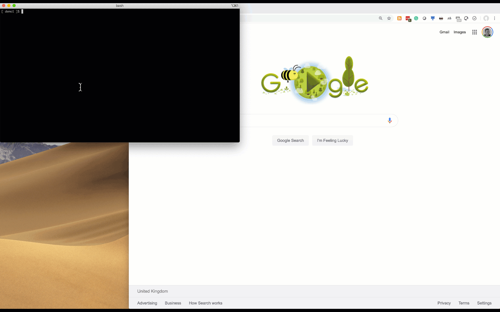

### Overview

You can enable a RDP server to be automatically configured for HPE Container Platform.

This is done in the `etc/bluedata_infra.tfvars` file.

```
rdp_server_enabled = true
rdp_server_operating_system = "LINUX"
```

This will cause the RDP server to be created the next time you run `./bin/terraform_apply.sh`.

The RDP server by default will have a dynamically assigned public IP adddress.  If you would like a static IP address (AWS EIP), configure the following option:

```
create_eip_rdp_linux_server = true
```

### Getting the Credentials

```
./generated/rdp_credentials.sh
```


## Using the RDP Server

The  RDP server is configure so that firefox autostarts:

- with common links such as HCP admin interface and MCS admin interface
- with HCP ssl certificate trusted

The RDP server also has links on the desktop:

- to retrieve the MCS admin password
- for ssh sessions to the controller, gatway and active directory server
- with txt file notes, containing installation instruction, list of worker IP addresses
- SSH key afor adding workers and gateway

### Accessing with a web browser



### Accessing with a RDP client

You can connect to the RDP server using a RDP Client such as the one provided by Microsoft

### RDP SSH/SCP

You can easily connect to the RDP server:

 - using ssh from your client machine using: `./generated/ssh_rdp_linux_server.sh`.
 - using sftp from your client machine using: `./generated/sftp_rdp_linux_server.sh`.  

### Limitations

- The RDP server is great for beginners but RDP can be slow.  
- If you find RDP too slow, consider using the [VPN](./README-VPN.md) instead
- Using copy and paste on RDP over https is cumbersome.
